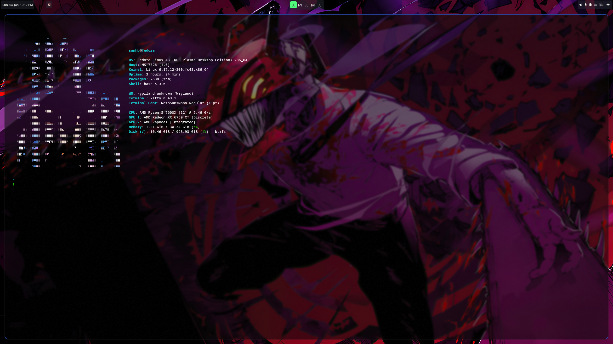
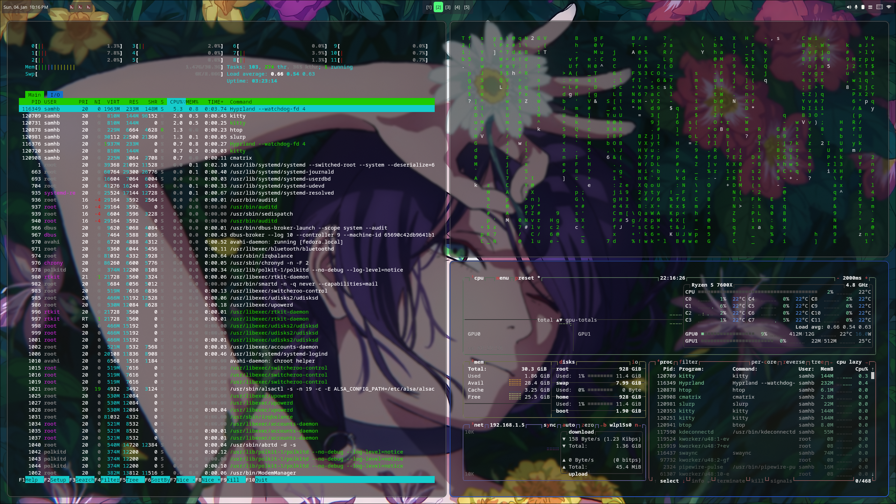
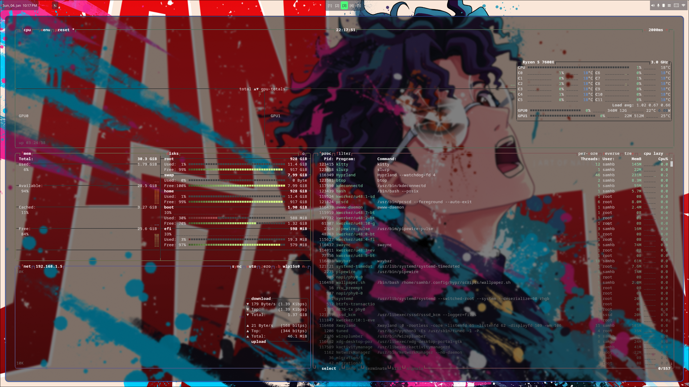
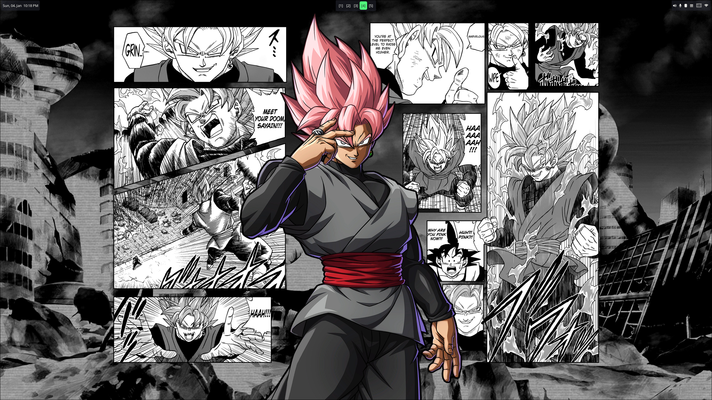
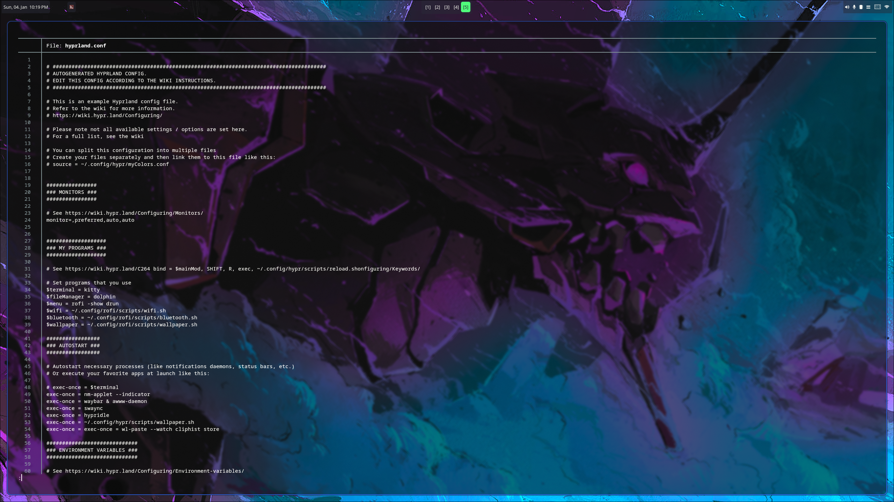
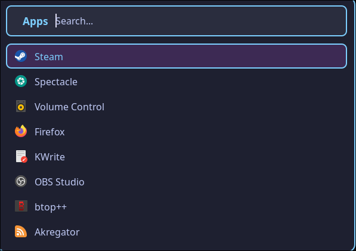
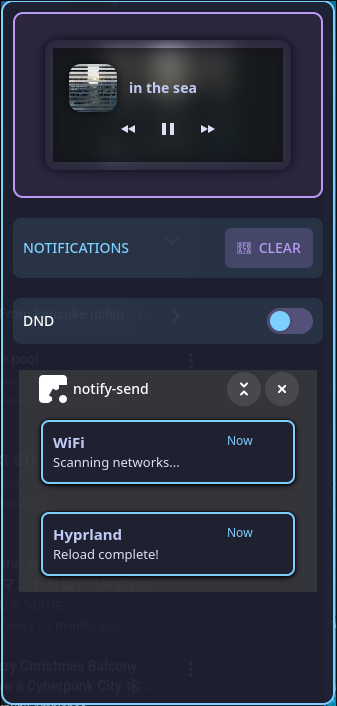

<h1 align="center">
  Samuel's Hyprland Dotfiles<br>
</h1>


> [!CAUTION]
> - These configs are tailored for **Fedora KDE** but should work on other distros with minor adjustments.
> - Some keybinds may conflict with your workflow - adjust in `hyprland.conf`
> - Wallpaper paths need to be updated to your actual image locations

## 📁 Repository Structure
```
~/dotfiles/
├── .config/
│   ├── fastfetch/
│   │   ├── config.jsonc       # System info display
│   │   └── my-logo.txt        # Custom ASCII art
│   ├── hypr/
│   │   ├── hypridle.conf      # Idle management config
│   │   ├── hyprland.conf      # Main Hyprland config
│   │   ├── hyprlock.conf      # Lock screen config
│   │   └── scripts/
│   │       ├── reload.sh      # Reload hyprland
│   │       └── wallpaper.sh   # Workspace wallpaper daemon
│   ├── kitty/
│   │   └── kitty.conf         # Terminal config
│   ├── rofi/
│   │   ├── config.rasi        # App launcher config
│   │   ├── scripts/
│   │   │   ├── bluetooth.sh   # Bluetooth management
│   │   │   ├── clipboard_history.sh # Clipboard history
│   │   │   ├── wallpaper.sh   # Wallpaper selector
│   │   │   └── wifi.sh        # WiFi management
│   │   └── themes/
│   │       └── current.rasi   # Current custom rofi theme
│   ├── swaync/
│   │   ├── config.json        # Notification settings
│   │   └── style.css          # Notification styling
│   └── waybar/
│       ├── config.jsonc       # Waybar modules & layout
│       ├── style.css          # Waybar styling
│       └── scripts/
│           └── launch.sh      # Reload waybar
└── README.md
```

<div align="center">

https://github.com/user-attachments/assets/e41b7de6-2717-4371-a81f-c4a124757f12
  
</div>

<details>
  
  <summary><strong> 📸 Screenshots </strong></summary>

<div align="center">

  <b> Workspace 1: </b>
  
  

  #

  <b> Workspace 2: </b>

  

  #

  <b> Workspace 3: </b>

  

  #

  <b> Workspace 4: </b>

  

  #

  <b> Workspace 5: </b>

  

  #

  <b> Rofi: </b>

  

  #

  <b> Sway: </b>

  

  #

  <b> Waybar: </b>
  
  
    
</div>

</details>

## ✨ Dependencies

| Package | Description |
|-----------|-------------|
| 🪟 [**Hyprland**](https://github.com/hyprwm/Hyprland) | Dynamic tiling Wayland compositor |
| 🎚️ [**Waybar**](https://github.com/Alexays/Waybar) | Highly customizable status bar with workspace indicators |
| 🎨 [**awww**](https://codeberg.org/LGFae/awww) | Animated wallpaper daemon with smooth transitions per workspace |
| 🔔 [**SwayNC**](https://github.com/ErikReider/SwayNotificationCenter) | Notification center with custom styling |
| 🔒 [**hyprlock**](https://github.com/hyprwm/hyprlock) | Modern screen locker with custom UI |
| ⏱️ [**hypridle**](https://github.com/hyprwm/hypridle) | Idle management and auto-lock |
| 🚀 [**Kitty**](https://github.com/kovidgoyal/kitty) | GPU-accelerated terminal emulator |
| 🔍 [**Rofi**](https://github.com/davatorium/rofi) | Application launcher and menu system |
| 📊 [**Fastfetch**](https://github.com/fastfetch-cli/fastfetch) | System info display |

## ⌨️ Key Bindings

| Keybind | Action |
|---------|--------|
| `SUPER + Return` | Open terminal (Kitty) |
| `SUPER + Q` | Close window |
| `SUPER + M` | Exit Hyprland |
| `SUPER + D` | Open app launcher (Rofi) |
| `SUPER + F` | Open file manager |
| `SUPER + W` | Open Firefox |
| `SUPER + L` | Lock screen |
| `SUPER + N` | Toggle notification center |
| `SUPER + 1-5` | Switch to workspace 1-5 |
| `SUPER + SHIFT + 1-5` | Move window to workspace |

## 🤝 Contributing

Feel free to fork and customize! If you have suggestions or improvements, open an issue or PR.

---
